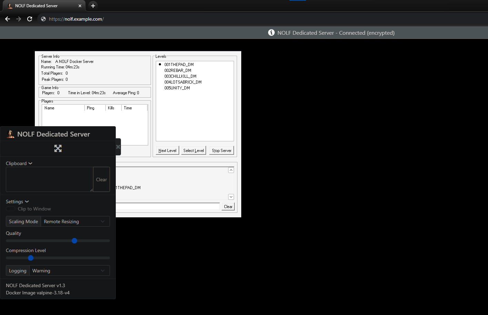

# The Operative: No One Lives Forever Dedicated Server
A Docker container for running a dedicated NOLF1 server under Wine, built from [jlesage/docker-baseimage-gui](https://github.com/jlesage/docker-baseimage-gui), with Alpine as the base OS. Since the NOLF series is currently abandonware, I have decided to include the gamefiles from the GOTY edition within the container, bringing its size up to `1.66GB`. The container also includes the latest version of Modernizer (`1.006 with Patch 3.1`) pre-installed. Due to this you can simply pull this container and have a functioning server without needing to supply any additional files.

### docker compose

```
version: "3.8"
services:
  nolf-server:
    image: ghcr.io/mistercalvin/nolf-server:latest
    container_name: nolf-server
    environment:
      TZ="" # Optional: Timezone for any log data inside container; Default: unset
      USER_ID="1000" # Optional: Set the UID for the user inside the container; Default: 1000
      GROUP_ID="1000" # Optional: Set the GID for the user inside the container; Default: 1000
      KEEP_APP_RUNNING="1" # Optional: Restart app inside the container if it has crashed; Default: 1
      DISPLAY_WIDTH="800" # Optional: Display height of the server application inside the container; Default: 800
      DISPLAY_HEIGHT="600" # Optional: Display width of the server application inside the container; Default: 600
      SERVER_NAME="A Docker NOLF Server" # Required: The name of your server (<= 24 Characters); Default: A NOLF Docker Server
      SERVER_PASSWORD="" # Optional: Password for your server; Default: unset
      SERVER_PORT="27888" # Required: Port the server will use; Default: 278888
      MAX_PLAYERS="8" # Required: Max Players for Server; Default: 8
      GAMETYPE="2" # 1 = Required: H.A.R.M vs. UNITY, 2 = DeathMatch; Default: 2
      DISABLE_WIZARD="False" # Optional: Disable server wizard on startup; Default: False
      CUSTOM_REZ="" # Optional: Any custom rez files, separated by a space (case-sensitive, WITHOUT file extension); Default: unset
      ADDITIONAL_ARGS="" # Optional: Additional game arguments; Default: unset
    volumes:
      - /path/to/your/customrez/files:/container/.wine/drive_c/nolf/custom/ # Directory for custom rez files you wish to load
    ports:
      - 27888-27889:27888-27889/udp # Query + Game
      - 5800:5800 # Server web management GUI
    restart: unless-stopped
```

### docker cli

```
docker run -d \
  --name=nolf-server \
  -e TZ="UTC"
  -e USER_ID="1000" \
  -e GROUP_ID="1000" \
  -e KEEP_APP_RUNNING="1" \
  -e DISPLAY_WIDTH="800" \
  -e DISPLAY_HEIGHT="600"
  -e SERVER_NAME="" \
  -e SERVER_PASSWORD="" \
  -e SERVER_PORT="" \
  -e MAX_PLAYERS="8" \
  -e GAMETYPE="2" \
  -e DISABLE_WIZARD="False" \
  -e CUSTOM_REZ="" \
  -e ADDITIONAL_ARGS="" \
  -p 27888-27889:27888-27889/udp \
  -p 5800:5800 \
  -v /path/to/your/customrez/files:/container/.wine/drive_c/nolf/custom/
  --restart unless-stopped \
  ghcr.io/mistercalvin/nolf-server:latest
```

Once the container is online you can access the web interface via the default port of `5800`. If you wish to password protect this page take a look [here](https://github.com/jlesage/docker-baseimage-gui#vnc-password) for steps on how to do so.
  
## Server Ports
NOLF requires Base Port + 1 (Default port is `27888`, so `27888-27889/udp`)

| Port      | Default  |
|-----------|----------|
| Query 		| 27888/udp|
| Join     | 27889/udp|

If you change the default server port you must change it on both sides of the container (e.g., if you choose port `27895`, the port section of your compose file or run command will need to be `27895-27896:27895-27896/udp`)

## User / Group Identifiers
The container allows you to modify the UID & GID of the user (`app`) inside the container. If you would like to know more, please see [this page](https://github.com/jlesage/docker-baseimage-gui#usergroup-ids) for more information on the topic. If you are unsure of what this is I recommend leaving `USER_ID` and `GROUP_ID` at their default values of `1000`, or omitting them from your Docker compose files or run commands.

## Building
If you intend to build the Dockerfile yourself, I have not pinned the packages as Alpine does not keep old packages. At the time of writing (2023/11/16) I have built and tested the container with the following package versions:

| Package   			  | Version  	 |
|-------------------------|--------------|
| i386/alpine			  | 3.18.4     	 |
| wine     				  | 8.19-r0	     |
| xvfb-run                  | 1.20.10.3-r1      |
| wget              | 3.1.6.0      |
| cabextract					  | 1.11-r1	 |

## Notes
- Server passwords do not work. I included the functionality for them inside the container startup script, but anyone will be able to join your server without supplying a password. If you have a fix for this please contact me and I will update the image.

- The image has additional environment variables you can customize, take a look at [this page](https://github.com/jlesage/docker-baseimage-gui#environment-variables) for more information. I have not tested the container with any variables other than what is defined in this repo; use these at your own risk.

- `KEEP_APP_RUNNING="1"` will ensure the server restarts automatically if it crashes. However if you have not disabled the server wizard (`DISABLE_WIZARD="False"`) it will restart to directly to the wizard GUI. Consider setting up your server using the GUI, then disabling the wizard for unattended automatic.

- You can pass additional arguments to the server using `ADDITIONAL_ARGS=""` in your compose file or run command. For example, to enable friendly-fire and turn on Audio Taunts, you could add `ADDITIONAL_ARGS="-NetFriendlyFire 1.0 -NetAudioTaunts 1"` to your compose file or run command. See below for all valid arguments:

```
      General Commands (compiled by "ShagnWagn"):
      -------------------------------------------

        * -NetDefaultWeapon:  This is used to set the default weapon players get when
                             the respawn.  Valid values:
             
                                  20 = None
                                  21 = Shepard Arms P38 9mm Pistol
                                  22 = Petri .38 Airweight Revolver
                                  23 = Braun 9mm Parabellum
                                  24 = Gordon 9mm SMG
                                  25 = Hampton MPL 9mm SMG
                                  26 = AK-47 Assault Rifle
                                  27 = Sportsman EX Crossbow
                                  28 = Hampton Carbine
                                  29 = Geldmacher SVD Sniper Rifle
                                  30 = Morris Model 14 Spear Gun
                                  31 = Laser Gun
                                  32 = Super Atomic Laser Weapon
                                  33 = Bacalov Corrector
                                  34 = M79 Grenade Launcher
                                  35 = Briefcase
                                  36 = Lipstick Impact Explosive
                                  37 = Lipstick Proximity Explosive
                                  38 = Lipstick Timed Explosive
                                  39 = Sleeping Gas
                                  40 = Stun Gas
                                  41 = Acid Gas
                                  42 = Belt Buckle/Zipcord

        * -NetHitLocation:  Turns location-based damage on/off (0=off, 1=on).

        * -NetFragScore: Turns frag scoring in H.A.R.M. vs UNITY games on/off (0=off,
                        1=on).

        * -RunSpeed: Used to adjust the run speed.  This value represents a percent
                    of the normal run speed.  Valid values: 0.5-1.5 (i.e., 50-150%).

        * -NetFallDamageScale:  Percentage of fall damage players take.  Valid values:
                               0.0-1.0 (i.e., 0-100%)

        * -RespawnScale:  Used to adjust the rate at which powerups respawn.  This
                         value represents a percent of the normal respawn time.
                         Valid values: 0.5-1.5 (i.e., 50-150%).
        
        * -NetArmorHealthPercent:  Used to give players a health bonus when they pick
                                  up armor powerups.  This value represents a percent
                                  of the armor value that should be given to the player
                                  as a health bonus.  Valid values: 0.0-1.0 (i.e.,
                                  0-100%).

        * -NetFriendlyFire: Turns friendly-fire on/off in H.A.R.M. vs UNITY games
                           (0=off, 1=on).

        * -NetIntelScore:  This represents how much "capturing" on intelligence item
                          is worth in H.A.R.M. vs UNITY games.  Valid values: 5-50.

        * -NetAudioTaunts:  This is used to enable/disable audio taunts. (0=off, 1=on).

        * -NetEndFrags:  This represents the winning score in Deathmatch games.  Valid
                        values: 5-50.

        * -NetEndScore:  This represents the winning score in H.A.R.M. vs UNITY games.
                        Valid values: 30-200

        * -NetEndTime:  This represents the length of time (in minutes) each level 
                       last.  Valid values: 5-60

        * -NetCAGameEnd:  Level ending conditions for H.A.R.M. vs UNITY games.  Valid
                         values:

                              0 = Score Reached
                              1 = Time Limit Reached
                              2 = Score or Time Limit Reached
                              3 = None

        * NetDMGameEnd:  Level ending conditions for Deathmatch games.  Valid values:

                              0 = Frag Limit Reached
                              1 = Time Limit Reached
                              2 = Frag or Time Limit Reached
                              3 = None

        * NetWeaponStay:  Toggles weapons instantly respawning after they are picked
                          up. (0=off, 1=on).
```
Please note - if you change a setting via `ADDITIONAL_ARGS` and then later remove it your server will continue to use the old value until you overwrite it. If you're having issues with any arguments take a look at `NetHost.txt` inside the main directory of the container.

## Images


